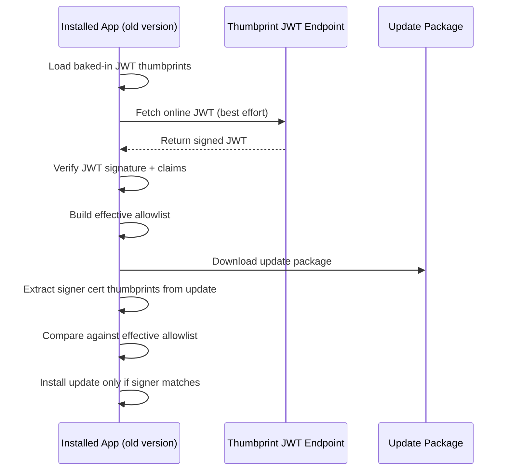

# Code-signing thumbprint bundle prototype

This prototype demonstrates a practical way to distribute trusted code-signing certificate thumbprints for update validation when certificate lifetimes become short.

The design uses:

- A **baked-in JWT** shipped inside the app (offline baseline trust)
- An **online JWT** fetched from Devolutions infrastructure (fresh trust data)
- A compact thumbprint payload (`x5t`, `x5t#S256`) for certificate pinning

The objective is to let older app versions recognize newer code-signing certificates early enough to install updates signed with those newer certificates.

## Layout

- `bundle/thumbprints.bundle.jwt`: Signed JWT bundle
- `bundle/thumbprints.payload.json`: Pretty JSON payload used for JWT
- `bundle/jwks.public.json`: Public JWK for verifier distribution
- `bundle/thumbprints.manifest.json`: Human-readable generation manifest
- `keys/jwt-private.pem`: Prototype signing key (non-production)
- `keys/jwt-public.pem`: Public key for verifiers
- `scripts/generate-thumbprint-bundle.ps1`: Generator script
- `csharp/`: C# verifier sample + tests
- `rust/`: Rust verifier sample + tests

## Quick start

From repository root:

```powershell
pwsh ./certs/prototype/scripts/generate-thumbprint-bundle.ps1 -Force
dotnet run --project ./certs/prototype/csharp/ThumbprintBundle.Sample/ThumbprintBundle.Sample.csproj
cargo run --manifest-path ./certs/prototype/rust/Cargo.toml
dotnet test ./certs/prototype/csharp/ThumbprintBundle.Sample.Tests/ThumbprintBundle.Sample.Tests.csproj
cargo test --manifest-path ./certs/prototype/rust/Cargo.toml
```

## Problem to solve

Without dynamic trust data, an older app only knows the certificate thumbprints baked at build time.

If a new app version is signed with a newly issued code-signing certificate not present in that baked list, older apps may reject the update.

## Trust model

### 1) Baked-in JWT (offline baseline)

- Embedded in app resources at build time.
- Assumed trusted because it is shipped inside a trusted, code-signed app binary.
- Used as a guaranteed fallback when network fetch is unavailable.

### 2) Online JWT (dynamic trust)

- Downloaded from a stable endpoint controlled by Devolutions.
- Treated as untrusted until signature and policy checks pass.
- Allows older apps to learn future code-signing thumbprints without app redeploy.

## JWT payload contract

- `iss`: `https://devolutions.net/productinfo/codesign-thumbprints`
- `aud`: `urn:devolutions:update-clients`
- `iat` / `nbf` / `exp`: UNIX epoch seconds
- `ver`: bundle schema/version string
- `thumbprints[]`: minimal certificate pinning entries only:
  - `x5t`: SHA-1 certificate thumbprint in base64url
  - `x5t#S256`: SHA-256 certificate thumbprint in base64url

Example payload:

```json
{
  "iss": "https://devolutions.net/productinfo/codesign-thumbprints",
  "aud": "urn:devolutions:update-clients",
  "iat": 1771015451,
  "nbf": 1771015451,
  "exp": 1786567451,
  "ver": "1",
  "thumbprints": [
    {
      "x5t": "jbWkO7iv5NL_uS2pAH2Jl6TMThM",
      "x5t#S256": "9JNTsMYSqyIMVujZox0EYoywHJyOiBgoClu48ptAYlY"
    },
    {
      "x5t": "UPdTMzgR_xHxkgJ0r94__URoshA",
      "x5t#S256": "1JFZbB6O7-m_LwmcMK6qorxjehm2AoDb2ZjXDl1cjYQ"
    }
  ]
}
```

The bundle currently includes thumbprints extracted from:

- `certs/Devolutions_CodeSign_2023-2026.crt`
- `certs/Devolutions_CodeSign_2025-2028.crt`

Notes:

- `x5t` = SHA-1 cert thumbprint in base64url (compatible with Windows thumbprint value after encoding conversion).
- `x5t#S256` = SHA-256 cert thumbprint in base64url.
- Signature algorithm is `RS256` in this prototype.

## Thumbprint compatibility

Windows APIs usually expect/show SHA-1 thumbprints as uppercase hex (no separators).

Conversion rule:

1. Base64url-decode `x5t` bytes
2. Hex-encode bytes in uppercase

Real examples from this prototype:

- `jbWkO7iv5NL_uS2pAH2Jl6TMThM` -> `8DB5A43BB8AFE4D2FFB92DA9007D8997A4CC4E13`
- `UPdTMzgR_xHxkgJ0r94__URoshA` -> `50F753333811FF11F1920274AFDE3FFD4468B210`

PowerShell example:

```powershell
$x5t = "jbWkO7iv5NL_uS2pAH2Jl6TMThM"
$b64 = $x5t.Replace('-', '+').Replace('_', '/')
switch ($b64.Length % 4) { 2 { $b64 += '==' }; 3 { $b64 += '=' } }
$bytes = [Convert]::FromBase64String($b64)
[Convert]::ToHexString($bytes)
```

C# example:

```csharp
using Microsoft.IdentityModel.Tokens;

var x5t = "jbWkO7iv5NL_uS2pAH2Jl6TMThM";
var windowsSha1 = Convert.ToHexString(Base64UrlEncoder.DecodeBytes(x5t));
```

## End-to-end flow



## How older apps recognize new code-signing certificates

1. Old app starts with baked allowlist.
2. It fetches and validates the online JWT.
3. Online JWT contains both:
   - currently used certificate thumbprints
   - upcoming certificate thumbprints
4. Update signed with upcoming/new cert is downloaded.
5. Old app validates signer thumbprint against refreshed allowlist.
6. Update installs successfully even though new cert was not baked into that old app build.

## Certificate rollover playbook

### Before signing with a new certificate

- Add the new cert thumbprints (`x5t`, `x5t#S256`) to the online JWT.
- Keep old certificate thumbprints present during transition.
- Publish JWT and verify clients accept it.

### During transition window

- Some updates may still be signed with old cert; some with new cert.
- Both are trusted while overlap remains in JWT.

### After migration

- Remove old cert thumbprints from online JWT when retirement is complete.
- New app releases should bake an updated JWT baseline.

## Validation policy recommendation

### Baked-in token

- Parse and schema-check.
- Verify issuer/audience consistency.
- Do not hard-fail on freshness claims (`exp`/`nbf`) if policy is "baked token is always trusted baseline".

### Online token

- Require signature verification (`RS256`, pinned public key/JWKS kid).
- Enforce issuer/audience and lifetime (`nbf`, `exp`, skew tolerance).
- Enforce a client freshness cap based on fetch time (for example, max `24 hours` since successful fetch), even if `exp` is later.
- On failure, keep operating with cached-last-good token or baked token.

## Publication and refresh policy

Recommended publication endpoints:

- `https://devolutions.net/productinfo/codesign.jwt`
- `https://devolutions.net/productinfo/codesign.jwks.json`

Recommended online token validity:

- `7 days` (`exp = iat + 7 days`)

Recommended client cache policy:

- Treat online token as fresh for at most `24 hours` since `fetchedAt`.
- If online token age exceeds `24 hours`, do not use it as primary trust source; retry fetch and fall back to baked token until refreshed.

Recommended refresh behavior:

- Fetch on app startup (best effort).
- Refresh every `6 hours` while app is running.
- Trigger an on-demand refresh before update validation if online token age exceeds `6 hours`.
- Add jitter/backoff to avoid synchronized traffic spikes.

Failure behavior:

- If refresh fails and online token age is `<= 24 hours`, continue using last known good online token.
- If refresh fails and online token age is `> 24 hours`, stop trusting cached online token and use baked token only.
- If no valid online token is available, fall back to baked-in token.
- Do not fail update checks solely because online fetch is unavailable.

## Effective allowlist resolution

Recommended precedence:

1. Last known good online token (if signature/claims are valid and cache age is `<= 24 hours`)
2. Otherwise baked token

For resiliency, store:

- last good online JWT
- fetch timestamp
- validation result metadata
- last refresh attempt timestamp

## Security controls

- Keep JWT signing keys separate from code-signing certificate private keys.
- Use HSM/KMS for production JWT signing (prototype commits key only for demo).
- Restrict accepted algorithms (`RS256` only in this prototype).
- Pin `iss`, `aud`, and key identity (`kid`/JWKS).
- Serve online JWT over HTTPS with endpoint hardening and monitoring.

## Mapping to prototype implementation

### Artifact generation

- JWT generation script: [certs/prototype/scripts/generate-thumbprint-bundle.ps1](scripts/generate-thumbprint-bundle.ps1)
- Generated payload: [certs/prototype/bundle/thumbprints.payload.json](bundle/thumbprints.payload.json)
- Signed JWT: [certs/prototype/bundle/thumbprints.bundle.jwt](bundle/thumbprints.bundle.jwt)
- Public JWKS: [certs/prototype/bundle/jwks.public.json](bundle/jwks.public.json)

### C# sample

- Claims model: [certs/prototype/csharp/ThumbprintBundle.Sample/BundleModels.cs](csharp/ThumbprintBundle.Sample/BundleModels.cs)
- Verification + thumbprint matching: [certs/prototype/csharp/ThumbprintBundle.Sample/BundleVerifier.cs](csharp/ThumbprintBundle.Sample/BundleVerifier.cs)
- Tests: [certs/prototype/csharp/ThumbprintBundle.Sample.Tests/BundleVerifierTests.cs](csharp/ThumbprintBundle.Sample.Tests/BundleVerifierTests.cs)

### Rust sample

- Claims model + verification: [certs/prototype/rust/src/lib.rs](rust/src/lib.rs)
- Sample executable: [certs/prototype/rust/src/main.rs](rust/src/main.rs)
- Tests: [certs/prototype/rust/tests/verify_bundle.rs](rust/tests/verify_bundle.rs)

## Optional external test certificates

If you need public test CA/material for additional integration scenarios, use the documented test assets from Devolutions Authenticode:

- Repository: https://github.com/Devolutions/devolutions-authenticode
- See README sections `Bootstrap Test CA` and `Private Certificate Authority`.

## Security note

This key management approach is intentionally insecure for production. Real signing should use HSM/KMS (for example Azure Key Vault signing) and short-lived, auditable signing workflows.

## Production hardening options (next step)

If you want to harden beyond prototype behavior:

- Add monotonic bundle sequence/version to prevent rollback.
- Add explicit denylist claim for emergency certificate revocation.
- Define staged rollout windows for new cert trust publication.
- Add telemetry on token source used (baked vs online) and verification outcomes.
